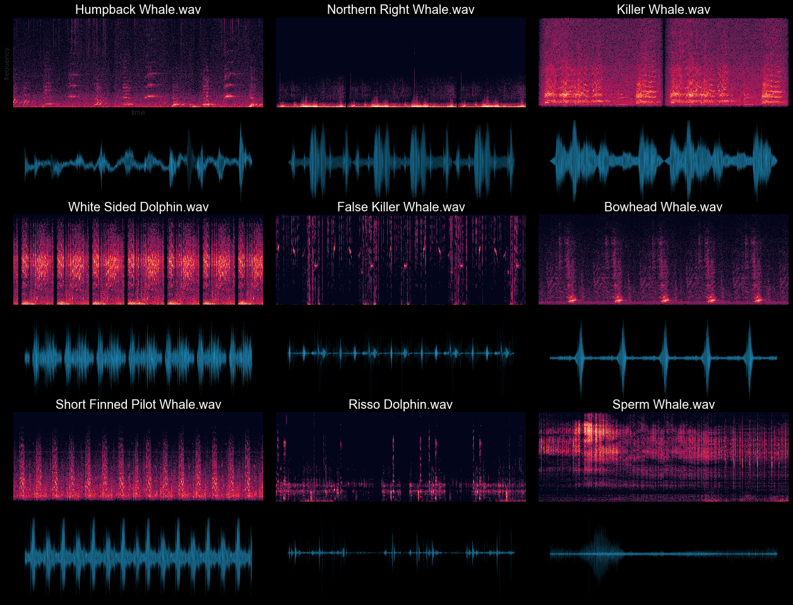
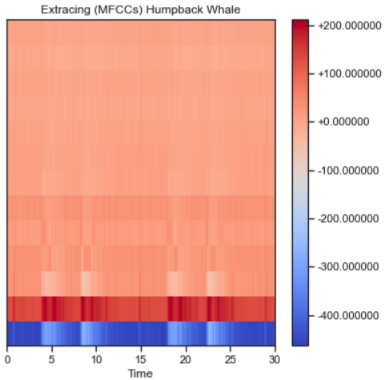
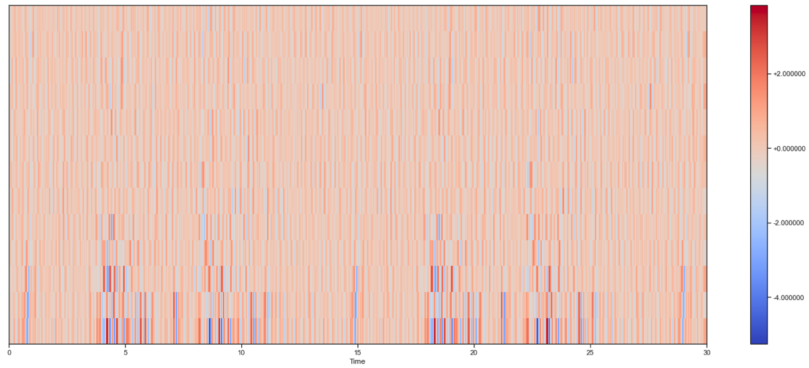
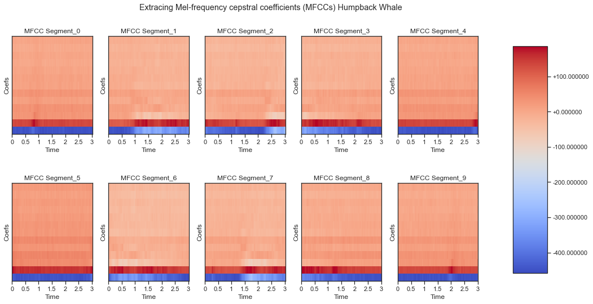
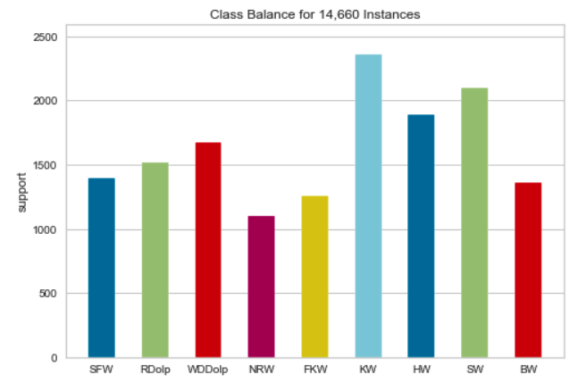
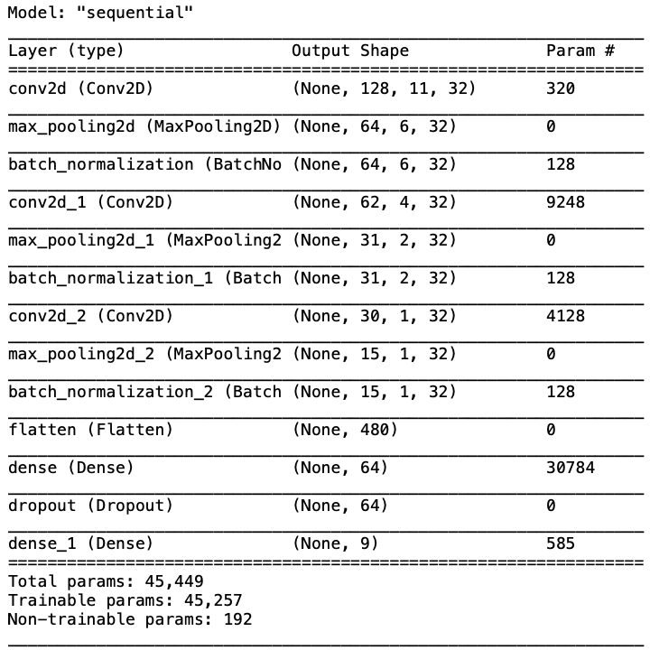
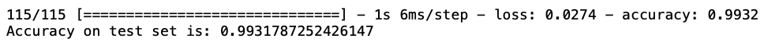
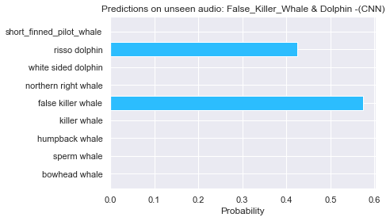

# Classifying marine animals with CNNs and NN

"Because water is denser than air, sound travels very efficiently underwater. Sounds from some species of marine life and human activity can be heard many miles away and, in some cases, across oceans. 

Passive acoustic instruments record these sounds in the ocean. There are some hydrophones that generate up to 24 terabytes a year! "e.g. Big Data"

This data provides valuable information that helps government agencies and industries understand and reduce the impacts of noise on ocean life.

By listening to sensitive underwater environments with passive acoustic monitoring tools, we can learn more about migration patterns, animal behavior and communication."
[quoted from noaa](https://noaa.maps.arcgis.com/apps/Cascade/index.html?appid=c653c78262a7487da42149ebc86f80c2)

The goal of this project is to explore marine animals classification. I will be implementing two machine learning models, a neural network and convolutional neural network. The marine animals that I'll be classifying:

* Killer Whale
* False Killer Whale
* Bowhead Whale
* White Sided Dolphin
* Risso Dolphin
* Northern Right Whale
* Humpback Whale
* Sperm Whale
* Short Finned Pilot Whale 

# About the Data

This project will use labeled raw audio from:

* [Watkins Whale Database](https://cis.whoi.edu/science/B/whalesounds/index.cfm)

* [Monterey Bay Aquarium Research Institute Freesound](https://www.mbari.org)

* [AudioSet: YouTube](https://research.google.com/audioset/)

# Preparing data for classification

* Reading and web scraping audio files and their labels.

* All the audio files were sliced into 30 second clips. Audio files that were longer than 30 seconds were decomposed into lengths of 30 seconds clips which helped generate more data. 

* Next I duplicated all the audio files per class and augmented those halves. I randomly augmented each file 
    * +/- 3 dB , 
    * +/- 2 semitones, 
    * time stretch 
    * and added some noise. 
    
* This doubled the size of data in each class where exactly half of the data in each class is an augmented version of the original file. 

Here is some exploratory visual representations of each class using spectrograms and oscillograms.
* Compare the waveform and the spectrogram from the dataset.

 

# Visualize MFCCs and MFCCs delta
[MFCCs wiki](https://en.wikipedia.org/wiki/Mel-frequency_cepstrum)

*  Audio feature choice for speech recognition/identification (1970s)

* Visualize MFCCs Humpback Whale audio sample

* Visualize MFCCs [Delta](https://wiki.aalto.fi/display/ITSP/Deltas+and+Delta-deltas) on the same Humpback Whale audio sample.

# Transform the waveform dataset to have MFCCs images and their corresponding labels as integer IDs.

* extracted 13 (MFCCs) on 10 segments over each 30 seconds audio files. "e.g. every 3 seconds" 
* generated more data to train on.

# Class Balance:

# Build and train the models

## Built and trained a Neural Network:

## Evaluate test set performance
running the model on the test set and check performance. 

## Display a confusion matrix
A confusion matrix is helpful to see how well the model did on each of the marine animals in the test set. 

## Built and trained a Convolutional Neural Network:

## Evaluate test set performance
running the model on the test set and check performance. 

## Display a confusion matrix
A confusion matrix is helpful to see how well the model did on each of the marine animals in the test set. 

# Run predictions on a new audio source
Finally, verifying the models' prediction output using an input audio outside of dataset.

* This 30 second audio clip consist of two marine animals to recognize. Lets see how the model perform!
[False Killer Whale & Dolphin](https://www.youtube.com/watch?v=2WY6Rf2gYKE)

## NN

## CNN

You can see that the NN model clearly recognizes only the dominate source in the audio "False Killer Whale."

Whereas, the CNN model clearly recognized two sources in the audio file as "False Killer Whale and Dolphin."

# Next steps

* Gather more data when it becomes available.

* Train models with (mel) spectrograms and compare the results.

* Implement Tensorflow audio data pipeline.

* Add more classes of marine animals to recognize.

* Introduce human sounds into the dataset. e.g. vessel and boats.

# MCMC

MCMC is a method used to estimate a posterior distribution of a paramter of interest by randomly sampling the probabilistic space.

